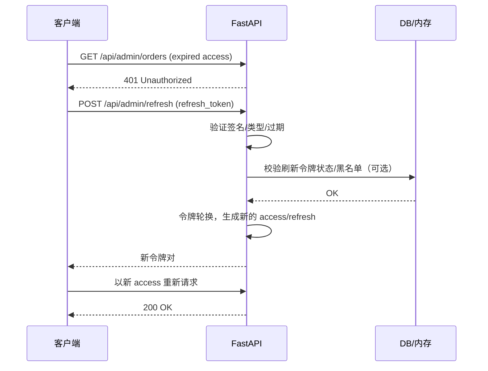

# JWT + 刷新令牌 鉴权需求文档（FastAPI + Next.js）

## 1) 需求描述

为当前项目提供用户登录与鉴权能力，采用 JWT（短期访问令牌）+ 刷新令牌（长期）双令牌方案：
- 用户登录获取令牌对（`access_token` + `refresh_token`）。
- 受保护接口使用 `access_token` 鉴权；过期后由前端透明刷新。
- 刷新接口使用 `refresh_token` 换发新令牌（并支持令牌轮换与失效）。
- `refresh_token` 仅通过 `HttpOnly+Secure+SameSite` Cookie 传递（前端不存储），有效期 7 天。
- 保证安全、易用与可观测，兼容 Next.js 前端集成
- 初始化管理员账号密码：admin/123456，并设置为管理员角色
- 初始化普通用户账号密码：user/123456，并设置为普通用户角色
- 普通用户登录只能看到首页和查看学生，不能管理学生，管理员登录可以调用所有接口，包括管理学生
 - 账号锁定与风控策略：30分钟内连续失败5次，锁定1小时

## 2) 需求目标

- 提供安全、标准、可扩展的用户鉴权机制。
- 访问令牌短期有效（60 分钟），刷新令牌长期有效（7 天）。
- 支持透明刷新，用户无感；刷新失败或无刷新令牌时，回退到重新登录。
- 支持令牌轮换与撤销（可选：黑名单/白名单机制，或 Redis）。
- 统一错误码与响应结构，完整日志与审计。

## 3) 技术栈与依赖

- 后端：FastAPI、Pydantic、fastapi.security、SQLAlchemy、Alembic。
- 加密：`passlib[bcrypt]`（密码哈希）、`PyJWT`
- 存储：PostgreSQL；暂不使用 Redis（刷新令牌状态/黑名单先存于本地内存，后期再评估 Redis）。
- 前端：Next.js

## 4) 概念与术语

- 访问令牌（Access Token）：短期 Bearer JWT，用于调用受保护 API。
- 刷新令牌（Refresh Token）：长期 JWT，仅用于换发新的访问令牌（不用于访问业务 API）。
- 令牌轮换（Rotation）：每次刷新签发新 `refresh_token` 并使旧的失效，提升安全。
- JTI：JWT ID，用于唯一标识令牌实例；便于撤销与审计。

## 5) 令牌设计

- Header：`alg=HS256`，`typ=JWT`。
- Payload：
  - `sub`: 用户 ID（UUID 字符串）
  - `type`: `access` | `refresh`
  - `exp`: 过期时间
  - `iat`: 签发时间
  - `jti`: 令牌唯一 ID
  - （可选）`roles`, `username`, `device_id`
- 有效期：
  - `access_token`: 60 分钟
  - `refresh_token`: 7 天

## 6) 业务流程

- 登录：校验用户名密码 → 颁发令牌对 → 记录审计日志。
- 调用受保护接口：校验 `access_token` → 通过返回数据；若过期 → 返回 401。
- 刷新：前端捕获 401 → 携带 `refresh_token` 调用刷新接口 → 返回新令牌对 → 重试原请求。
- 登出（可选）：前端提交 `refresh_token` → 后端标记失效。
 - 刷新令牌存储：`refresh_token` 仅在 `HttpOnly+Secure+SameSite` Cookie 中传递，前端不持久化。
 - 令牌复用检测：当旧 `refresh_token` 被再次使用时，撤销相关刷新家族的所有令牌并要求重新登录。

### 时序图（刷新）

## 7) 实现步骤（自下而上，核心优先，循序渐进）

说明：每一步尽量小、可独立验证；每步同时提交对应的单元测试/集成测试，便于及时 Review 与回归。先实现“核心闭环”，再逐步增强。

### 阶段A：数据与安全基础（核心）
1. 建立 `users` 表（模型与迁移）
   - 目标：支持最小用户信息，满足登录与角色判断。
   - 字段建议：`id`(UUID 字符串)、`username`(唯一)、`password_hash`、`role`('admin'|'user')、`is_active`(默认true)、`token_version`(默认1)、`failed_login_attempts`(默认0)、`lock_until`(可空时间)。
   - 产物：`api/models/users.py`、Alembic 迁移（新增 `users`）。
   - 测试：创建用户成功；`username` 唯一约束；默认值正确。

2. 密码哈希与校验工具
   - 目标：封装密码哈希与验证（bcrypt）。
   - 产物：`api/utils/security.py` 中 `hash_password`/`verify_password`。
   - 测试：明文→哈希→验证为真；错误口令验证为假；哈希具有随机盐（两次哈希不同）。

3. 开发/测试环境种子数据（仅 dev/test）
   - 目标：初始化 `admin/123456`（角色 admin）与 `user/123456`（角色 user）。
   - 产物：`api/bin/seed_users.py` 或 fixtures。
   - 测试：种子脚本可重复执行（幂等）；两用户存在且可通过 `verify_password` 验证。

4. 建立 `refresh_tokens` 表（模型与迁移）
   - 目标：持久化刷新令牌家族与轮换状态（暂不使用 Redis）。
   - 字段建议：`id`(自增)、`jti`(唯一)、`parent_jti`(可空)、`user_id`、`issued_at`、`expires_at`、`used_at`(可空)、`revoked`(bool) 、`revoked_reason`(可空)、`device_id`(可空)、`ip`(可空)、`user_agent`(可空)。
   - 产物：`api/models/refresh_tokens.py`、Alembic 迁移。
   - 测试：插入/查询；`jti` 唯一；`expires_at` 超期判断函数正确。

5. JWT 工具（签发/校验）
   - 目标：签发并校验 access/refresh 两类 JWT，加入 `sub`(用户ID)、`type`、`jti`、`iat`、`exp`；`HS256`；`refresh_token` 7 天；`access_token` 60 分钟。
   - 产物：`api/utils/jwt_tokens.py`（`create_access_token`, `create_refresh_token`, `verify_token`）。
   - 测试：
     - access/refresh 类型区分与过期校验；
     - `sub`、`jti` 存在且格式正确；
     - 过期与签名错误分别抛出明确异常。

### 阶段B：鉴权闭环（核心）
6. 登录接口 `/auth/login`
   - 目标：校验用户名/密码与锁定状态，成功时：
     - JSON 返回 `access_token`；
     - 通过 `Set-Cookie` 写入 `refresh_token`（`HttpOnly+Secure+SameSite`，7天）。
     - 持久化 `refresh_tokens` 新记录（作为家族起点）。
   - 产物：`api/controllers/auth_controller.py` 登录路由；`api/services/auth_service.py` 登录逻辑。
   - 测试：成功登录（返回 access、写入 Cookie、DB 有 refresh 记录）；错误口令计一次失败；锁定中的用户返回 403。

6.1 登录失败计数与锁定策略
   - 目标：实现“30分钟内连续失败5次→锁定1小时”。
   - 产物：更新用户失败计数与 `lock_until` 的服务函数。
   - 测试：在 30 分钟窗口内 5 次失败后被锁定；1 小时后可重新尝试；窗口外失败重置。

6.2 刷新接口 `/auth/refresh`（轮换与复用检测）
   - 目标：仅依赖 Cookie 中的 `refresh_token`：
     - 校验 refresh→签发新 access 与新 refresh（轮换），更新/插入 `refresh_tokens`；
     - 当旧 refresh 被再次使用（复用）时：撤销该家族所有刷新令牌（`revoked=true`），返回 401。
   - 产物：控制器与服务逻辑；轮换/复用检测涉及对 `used_at` 与 `revoked` 原子更新。
   - 测试：
     - 正常刷新：返回新 access、设置新 Cookie、旧 refresh 置 `used_at`；
     - 复用旧 refresh：全家族 `revoked`，后续刷新/访问均失败；
     - 过期 refresh：返回 401。

6.3 登出接口 `/auth/logout`
   - 目标：撤销当前 refresh 家族（或当前链），并清除 Cookie。
   - 测试：登出后刷新失败；访问需重新登录。

### 阶段C：访问控制接入（核心闭环完成后）
7. 访问令牌依赖与用户注入
   - 目标：封装 FastAPI 依赖，验证 `Authorization: Bearer <access>`，校验 `type=access`、过期、用户存在且 `is_active`。
   - 产物：`api/core/auth_dependency.py`。
   - 测试：无 token/过期/签名错误→401；有效 token→注入当前用户。

8. RBAC 守卫
   - 目标：基于用户 `role` 的路由装饰器/依赖（如 `require_roles('admin')`）。
   - 测试：普通用户访问管理员接口→403；管理员→200。

9. 应用到学生接口
   - 目标：学生“管理”接口需 `admin`；学生“查看”接口允许 `user`。
   - 测试：对现有 `students` 路由编写鉴权用例，确保预期行为。

### 阶段D：前端最小集成（最后）
10. 登录页与状态管理
   - 目标：实现登录表单（提交到 `/auth/login`），在内存保存 `access_token`，`refresh_token` 全程仅在 Cookie。
   - 测试：登录后可访问受保护页面；刷新浏览器后依然可通过刷新接口续期。

11. 401 拦截与自动刷新
   - 目标：前端请求拦截 401→调用 `/auth/refresh`→成功后重放请求；失败则跳转登录。
   - 测试：模拟 access 过期触发自动刷新与重放；无 Cookie 时跳登录。

12. 退出登录
   - 目标：调用 `/auth/logout` 并清理前端状态。
   - 测试：退出后访问受保护页被重定向登录。

### 渐进增强（可择期）
- 秘钥轮换（`kid`）、`iss`/`aud` 校验与时钟容差。
- `token_version` 变更触发全量撤销（改密/禁用时）。
- 设备指纹与风控日志（ip/ua/device_id）。
- 并发刷新幂等与告警（先以行级约束防并发复用，后续再优化）。
